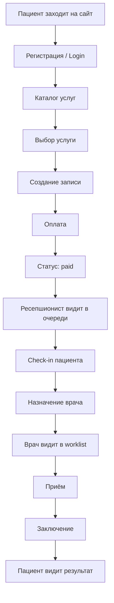

# Домен, роли, экраны

## Бизнес-контекст

RIS-платформа для медицинского учреждения. Пациент записывается на услугу онлайн, оплачивает, приходит в клинику. Ресепшионист ведёт очередь и направляет к врачу. Врач проводит приём и фиксирует заключение.

## Сущности (entities)

| Entity | Описание | Ключевые поля (ориентир) |
|--------|----------|--------------------------|
| `user` | Аутентифицированный пользователь | id, email, role, profile |
| `patient` | Профиль пациента | userId, fullName, phone, birthDate |
| `doctor` | Профиль врача | userId, fullName, specialization |
| `service` | Медицинская услуга | id, name, price, duration, description |
| `appointment` | Запись на приём | id, patientId, serviceId, status, scheduledAt, doctorId? |
| `payment` | Платёж | id, appointmentId, amount, status, provider |
| `medical-verdict` | Заключение врача | id, appointmentId, doctorId, diagnosis, conclusion, createdAt |

Точные DTO — от backend API. Типы и Zod-схемы — в `5_entities/{name}/types/index.ts`. См. [types-and-zod.md](./types-and-zod.md).

## Статусы appointment

```ts
type AppointmentStatus =
  | "draft"              // черновик, услуга выбрана
  | "pending_payment"    // ждёт оплаты
  | "paid"               // оплачено, ждёт ресепшен
  | "checked_in"         // пациент на ресепшене
  | "assigned"           // назначен врач
  | "in_progress"        // приём идёт
  | "completed"          // заключение готово
  | "cancelled";
```

Статусы могут отличаться от backend — синхронизировать при интеграции.

## Features (user actions)

| Feature | Actor | Описание |
|---------|-------|----------|
| `auth-by-email` | all | Login / register |
| `select-service` | patient | Выбор услуги из каталога |
| `create-appointment` | patient | Создание записи |
| `pay-appointment` | patient | Оплата (redirect / widget) |
| `check-in-patient` | receptionist | Отметить прибытие |
| `assign-doctor` | receptionist | Назначить врача на запись |
| `submit-verdict` | doctor | Написать заключение |
| `cancel-appointment` | patient, receptionist | Отмена записи |

## Экраны MVP

### Public `(public)/`

| Route | Page | Описание |
|-------|------|----------|
| `/` | Landing | Описание платформы, CTA регистрации |
| `/login` | Login | Вход |
| `/register` | Register | Регистрация пациента |
| `/services` | Services catalog | Каталог услуг (может быть public) |

### Patient `(patient)/patient/`

| Route | Описание |
|-------|----------|
| `/patient` | Dashboard: ближайшие записи, быстрые действия |
| `/patient/services` | Выбор услуги → создание записи |
| `/patient/appointments` | Список своих записей |
| `/patient/appointments/[id]` | Детали записи + статус оплаты |
| `/patient/appointments/[id]/payment` | Checkout |
| `/patient/appointments/[id]/result` | Заключение врача (если completed) |

### Reception `(reception)/reception/`

| Route | Описание |
|-------|----------|
| `/reception` | Очередь записей (фильтры: дата, статус) |
| `/reception/appointments/[id]` | Карточка записи + пациент + assign doctor |

### Doctor `(doctor)/doctor/`

| Route | Описание |
|-------|----------|
| `/doctor` | Рабочий список на сегодня |
| `/doctor/visits/[id]` | Карточка визита + форма заключения |

## User flow diagram



## Auth & permissions

```ts
// shared/auth/permissions.ts
type Role = "patient" | "receptionist" | "doctor" | "admin";

const ROUTE_ACCESS: Record<string, Role[]> = {
  "/patient": ["patient"],
  "/reception": ["receptionist"],
  "/doctor": ["doctor"],
};
```

Guard проверяет `useSessionQuery()` → role → redirect на `/login` или `/unauthorized`.

## API endpoints (ориентир для frontend)

Backend определяет контракт. Ориентиры:

```
POST   /auth/register
POST   /auth/login
POST   /auth/logout
GET    /auth/me

GET    /services
GET    /services/:id

POST   /appointments
GET    /appointments/mine
GET    /appointments/:id
PATCH  /appointments/:id/cancel

POST   /appointments/:id/payment
GET    /payments/:id/status

GET    /reception/queue
PATCH  /appointments/:id/check-in
POST   /appointments/:id/assign

GET    /doctor/worklist
POST   /appointments/:id/verdict
GET    /appointments/:id/verdict
```

Реальные endpoints — от backend-команды. Frontend адаптирует `5_entities/*/`.

## Widgets map

| Widget | Used on |
|--------|---------|
| `app-shell` | All authenticated pages |
| `role-sidebar` | patient / reception / doctor layouts |
| `appointment-flow` | patient service selection → payment wizard |
| `reception-queue-table` | `/reception` |
| `doctor-visit-panel` | `/doctor/visits/[id]` |
